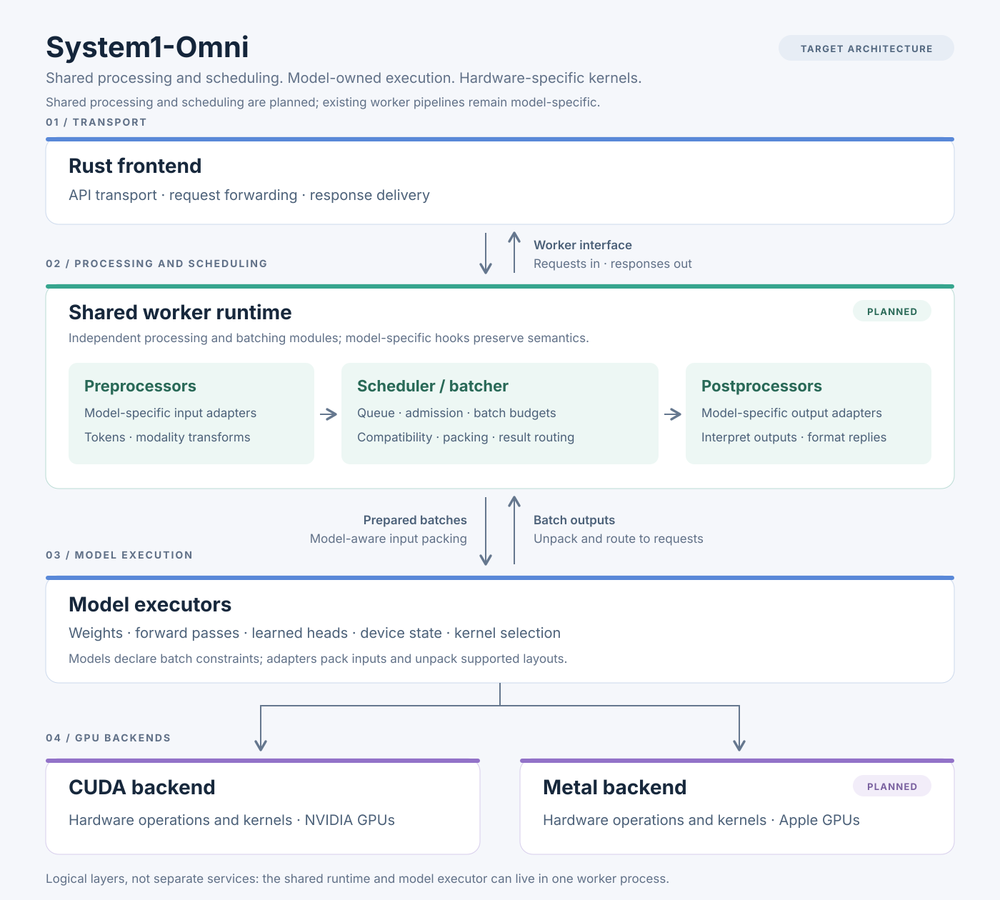
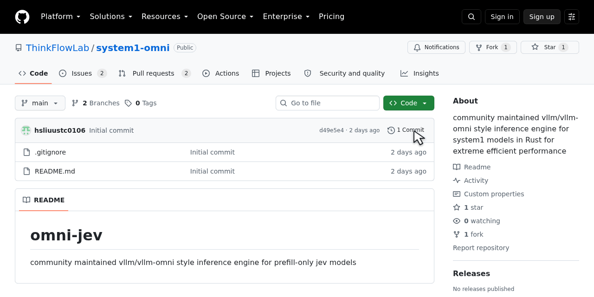

# System1-Omni

A community-maintained inference engine for prefill-only System1-Omni models, designed around a Rust frontend, model-owned execution, and high-performance CUDA and Metal backends.

The project is in its initial design stage. The architecture below describes the intended implementation; model engines and GPU backends are not implemented yet.

## Architecture

Share serving infrastructure; let each model own its execution.

| Layer | Responsibility |
| --- | --- |
| Rust frontend | API, request lifecycle, and response delivery through a small engine interface. |
| System1-Omni models | Model-specific preprocessing and postprocessing, batching, state, execution, and kernel selection. |
| CUDA backend | High-performance GPU operations for NVIDIA GPUs. |
| Metal backend | High-performance GPU operations for Apple GPUs. |

Each model owns its complete request-to-result path. Shared utilities stay minimal and are extracted when implementations need the same functionality. Backends can optimize for their hardware without requiring identical internal implementations.

## Repository layout

Implementation code lives under `src/`; recipes and documentation stay at the repository root.

| Directory | Responsibility |
| --- | --- |
| [`src/frontend/`](src/frontend/) | Rust serving code and the small engine interface. |
| [`src/models/laya/`](src/models/laya/) | LAYA preprocessing, batching, state, execution, and output processing. |
| [`src/backends/cuda/`](src/backends/cuda/) | NVIDIA GPU operations and kernel integration. |
| [`src/backends/metal/`](src/backends/metal/) | Apple GPU operations and kernel integration. |
| [`recipe/`](recipe/) | Model setup instructions, launch commands, configuration examples, and example requests. |
| [`docs/`](docs/) | Project documentation and architecture assets. |

These directories currently document ownership; implementations will be added incrementally. They do not prescribe process boundaries. Shared utilities will be extracted when concrete implementations need them.

## Supported models

No models are implemented yet. LAYA is the first planned model:

| Model | Status |
| --- | --- |
| LAYA | Planned |

CUDA and Metal coverage will be documented per model as implementations are added and validated.

## Stay Tuned with Us

If you find system1-omni useful, [give us a star on GitHub](https://github.com/ThinkFlowLab/system1-omni)
to support the project and help others discover it!

