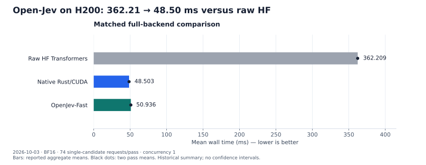

# Optimizing Open-Jev in System1-Omni

Open-Jev-27B-v1.1 makes decisions with a prefill pass and a learned scoring
head. On our 74-request H200 workload, System1-Omni's native Rust/CUDA worker
reduced mean warm HTTP latency from **362.21 ms with raw HF Transformers to
48.50 ms**, a **7.47× speedup**. A separate native CUDA Graph experiment reached
**47.11 ms** after warming the workload's token lengths. Optimizing Gated
DeltaNet preparation then reduced longer standalone GDN calls by about **13%**,
while its separate HTTP comparison improved only **0.42%**.

Those results describe different experiments. They are not a cumulative
optimization ladder: **the merged GDN change with CUDA Graph replay enabled has
not been timed together**. This post records isolated optimizations from October
1–3, integration validation on October 4, and processing/runtime A/B regression
checks on October 5, 2026. We inspected main at
[`f594d7d`](https://github.com/ThinkFlowLab/system1-omni/tree/f594d7dfc4c2bef812e23f7ed73573be9625b287).
Each update below identifies its measured revisions; these historical experiments
do not constitute a fresh benchmark of current main.

## The PR-by-PR experiment map

A PR can contain several independently tested improvements. The table links each
change to its own baseline and detailed update. Mean HTTP milliseconds are shown
unless a different boundary is stated; rows cannot be added into a waterfall.

| PR and improvement | A/B comparison | Result and interpretation |
| --- | --- | --- |
| [#19](https://github.com/ThinkFlowLab/system1-omni/pull/19): native executor ancestry | Cua-S1 4B on RTX 6000 Ada; original Python timings reused from #13 | Establishes the shared native path; no isolated Open-Jev gain assigned |
| [#52](https://github.com/ThinkFlowLab/system1-omni/pull/52): exact-length graph replay | Cua-S1 4B, direct worker HTTP on GPU 3 | Short-case medians improve; separate campaign from the Open-Jev experiments |
| [#55](https://github.com/ThinkFlowLab/system1-omni/pull/55): native Open-Jev support | Raw HF → complete native eager backend | 362.209 → 48.503 ms, 7.47×; LoRA merge, shared execution and attention gating are bundled |
| #55: cached residual RMSNorm | Uncached → register retention plus fixed-width unrolling | 51.424 → 50.097 ms, 2.58% lower; both performance gates pass |
| #55: packed BF16 SiLU | Scalar → eight-element packing, cached norm fixed | 49.527 → 48.297 ms, 2.48% lower; both performance gates pass |
| #55: eight-entry graph replay | Eager → graph-eight | Short 19.829 → 18.882 ms; mixed 48.086 → 95.289 ms regresses |
| #55: 64-entry graph cache | Graph-eight → graph-64; eager retained as control | Mixed 95.289 → 47.112 ms; 2.03% lower than matched eager |
| [#68](https://github.com/ThinkFlowLab/system1-omni/pull/68): packed GDN preparation | Original → packed TF32 preparation | ~13% longer complete-call gain; HTTP 48.408 → 48.205 ms misses the 2% gate |
| [#78](https://github.com/ThinkFlowLab/system1-omni/pull/78): processing/executor split | `07e67e16` → `fbb974b5`, synthetic direct-worker workload | Regression gates pass at concurrency 1/8/16; no speedup claim |
| [#80](https://github.com/ThinkFlowLab/system1-omni/pull/80): FIFO admission before dispatch | `cb3c37fa` → `887b29f1`, newly measured arms | Regression gates pass at concurrency 1/8/16; no speedup claim |

The Open-Jev kernel/backend rows use the 74 real single-candidate requests. The
later refactors use 64 synthetic requests per model with multiple questions and
candidates, a different HTTP timer and another exact device. Their ~109 ms serial
mean is not a regression from the ~48 ms JevBench result.

## PR #55: establishing the complete-backend baseline

We compared three complete serving backends on one H200, using the same Rust
frontend, prepared model inputs and request order. The workload contains 74 real
JevBench `noul` requests with one candidate each, 80–3,399 tokens, BF16 and
concurrency 1. Each backend reused one server for an excluded feasibility pass
and two measured passes of 74 requests.

| Backend | Mean HTTP latency | Pass 1 / pass 2 |
| --- | ---: | ---: |
| Raw HF Transformers | 362.209 ms | 362.238 / 362.180 ms |
| Native Rust/CUDA, eager | 48.503 ms | 48.471 / 48.535 ms |
| Original OpenJev-Fast | 50.936 ms | 51.097 / 50.775 ms |



*Figure 1. The matched October 3 full-backend comparison. Bars show reported
aggregate means; black dots show the two pass means. The plot includes the
localhost frontend, tokenization, worker execution and UTF8 response decoding.
Preparation, readiness, first inference and feasibility are excluded. Values
come from the [historical validation summary](https://github.com/ThinkFlowLab/system1-omni/blob/e3cb4a215d76e5df929f60e71552531408f95c72/recipe/open_jev/validation.md#raw-hf-transformers-comparison-2026-10-03).
The two dots are observed variation, not confidence intervals.*

The raw HF arm used the original server with unmerged PEFT LoRA modules,
stock SDPA and the PyTorch fallback for linear attention and convolution.
Optional FLA and causal-convolution dispatch was explicitly disabled. Native
used a merged adapter and the repository's CUDA kernels; Fast retained its
custom kernels and graph stack. This measures the entire backend change,
including adapter execution, rather than isolating the programming language.

Native and HF agreed on all 74 thresholded decisions and both scored 64/74,
but their probabilities were not identical: the maximum absolute difference
was 0.020423. Fast scored 63/74 with one different decision. Native's mean was
4.78% below Fast in this run, while Fast had a lower median. This subset does
not establish general accuracy superiority or cover multi-candidate prefix
sharing. The [validation record](../../recipe/open_jev/validation.md) retains
the percentile timings, numerical differences and exact baseline setup.

The [OpenJev-Fast write-up](https://yiqilyu.me/open-jev-fast/) motivated this
investigation. Its 17.3 ms example uses B300, pretokenized prompts and a
forward-plus-head timer; its 231-task HTTP result is 42.0 ms. Neither is the
74-request H200 HTTP measurement plotted here.

## PRs #19 and #52: the native executor and graph ancestry

[PR #19](https://github.com/ThinkFlowLab/system1-omni/pull/19) established the
native text executor for Cua-S1 4B. Its RTX 6000 Ada results compare against
Python timings reported in #13; they are not a newly matched Open-Jev A/B.
We reuse its executor and kernel design without assigning an Open-Jev speedup
to that original PR.

[PR #52](https://github.com/ThinkFlowLab/system1-omni/pull/52) then isolated
graph replay: the same Cua-S1 executable/library ran `CUA_S1_GRAPH=0/1`, with
unchanged GEMM selection and arithmetic. The measured implementation was
`61238a0`, based on `8367333`; later recovery fixes landed at `a55a111` without
rerunning the latency campaign. GPU 3 (the archived report labels it L20X/SM89)
served the pinned merged BF16 4B checkpoint directly over HTTP at concurrency 1. Each
case had three warmups and twenty requests in each of two measured runs after
an excluded feasibility run. Representative **p50** milliseconds were:

| Cua-S1 tokens | Eager run 1 / 2 | Graph run 1 / 2 |
| --- | ---: | ---: |
| 139 | 6.31 / 6.24 | 5.73 / 5.74 |
| 292 | 8.58 / 8.69 | 7.99 / 8.01 |
| 15,446 | 355.10 / 355.05 | 355.50 / 355.73 |

All 17 correctness responses matched exactly, including changed-input replay,
scratch growth and eviction. The hypothesis held for short repeated lengths;
the long case showed no meaningful gain. First use added capture cost. The
[six-case report and raw samples](../benchmarks/cua-s1-cuda-graphs/README.md)
preserve the protocol and remaining recovery-fix validation limits. This Cua-S1
experiment is separate from the H200 Open-Jev measurements below.

## The native request path

The current worker separates prompt preparation from model execution. Rust
validates and tokenizes each candidate; the shared Qwen3.5/3.8 executor runs
one prefill forward per candidate. The final hidden state is downloaded for
the learned CPU scalar head, then the processor calibrates and reconstructs
the complete question's answer. There is no autoregressive decode loop.
See the [model contract](../../src/models/open_jev/README.md),
[native recipe](../../recipe/open_jev/native.md) and
[architecture contracts](../architecture.md).

The backend reused the native prefill implementation from
[PR #19](https://github.com/ThinkFlowLab/system1-omni/pull/19), with support and
shared execution integrated through
[PR #55](https://github.com/ThinkFlowLab/system1-omni/pull/55). The initial
native path also merges LoRA weights and applies the attention sigmoid gate in
the attention epilogue, removing a launch and output read/write pass per
full-attention layer while retaining the BF16 rounding points. LoRA merging,
shared execution and gate fusion have no individual Open-Jev A/B in the record.
Their contribution is included in the complete-backend comparison; assigning
each a fraction of its 7.47× gain would require separate ablations.

### PR #55 update, October 1: cache residual RMSNorm values

The residual-add/RMSNorm kernel wrote rounded residuals, reduced their squared
sum, then reread those residuals for normalization. The
[cached implementation](https://github.com/ThinkFlowLab/system1-omni/blob/61b83b380baca912c0dbd989d175cb3da8a881ae/src/backends/cuda/qwen3_5/norm.cu)
retains each thread's values in FP32 registers and unrolls the actual widths,
2560/5120. The 256-thread assignment, sequential per-thread sum, residual BF16
rounding and output BF16 rounding are preserved; other widths retain the scalar
path. This A/B tests caching and fixed-width specialization together.

The frozen worker/frontend was `202c0e1`; two ABI4 libraries differed only in
the normalization translation unit. Candidate source SHA256 starts `756c9d40`;
complete library hashes and the frozen protocol are in the
[evidence ledger](../assets/blog/open-jev-20261005/source-data.json). Four kernel
reference tests used a separate ABI3 validation build, while serving retained
ABI4. The H200 GPU 5 pair used NUMA 1 / CPUs 56–71, BF16, graph disabled and
the same 74 requests. One feasibility pass preceded two measured passes on each
reused server. HTTP collection was inactive, but CUPTI could remain loaded.

| Warm HTTP | Baseline pass 1 / 2 | Cached pass 1 / 2 | Aggregate before → after |
| --- | ---: | ---: | ---: |
| 74 requests/pass | 51.440 / 51.409 ms | 50.144 / 50.049 ms | 51.424 → 50.097 ms, **2.58% lower** |

Two separate traces per representative sum 128 residual-norm launches:

| Tokens | Original family mean | Cached family mean | Reduction |
| --- | ---: | ---: | ---: |
| 107 | 1.944291 ms | 0.463520 ms | 76.16% |
| 936 | 2.435333 ms | 1.385842 ms | 43.09% |
| 3,399 | 9.864781 ms | 5.345926 ms | 45.81% |

All 74 probabilities and decisions were unchanged. The four GPU tests, ≥25%
short-family reduction and ≥2% HTTP reduction beyond observed pass spread passed.
The HTTP means had disjoint two-pass ranges; these are observations, not
confidence intervals. Individual latency samples and timing-excluded response
hashes are now preserved in [the A/B pass export](../assets/blog/open-jev-20261005/ab-passes.jsonl).

### PR #55 update, October 2: pack eight BF16 SiLU elements

The activation path loads gate/up vectors in 16-byte packs and computes eight
elements per thread. It retains `expf` and both original BF16 rounding points.
Width and stride divisible by eight plus aligned pointers select packing;
other layouts keep the scalar path. The
[implementation commit](https://github.com/ThinkFlowLab/system1-omni/commit/61b83b380baca912c0dbd989d175cb3da8a881ae)
contains both accepted kernel changes, but this experiment held cached RMSNorm
fixed and varied only SiLU. The candidate translation-unit SHA starts `b739f1bc`.

The same frozen worker/frontend served both arms on H200 GPU 2, NUMA 0 / CPUs
0–15, BF16 and graph disabled. One excluded feasibility pass and two measured
74-request passes reused each server. The timer and inactive-collection/CUPTI
context matched the October 1 procedure within this new campaign.

| Warm HTTP | Baseline pass 1 / 2 | Packed pass 1 / 2 | Aggregate before → after |
| --- | ---: | ---: | ---: |
| 74 requests/pass | 49.563 / 49.490 ms | 48.286 / 48.307 ms | 49.527 → 48.297 ms, **2.48% lower** |

The separate traces sum 64 activation launches per request:

| Tokens | Scalar family mean | Packed family mean | Reduction |
| --- | ---: | ---: | ---: |
| 107 | 0.679600 ms | 0.304576 ms | 55.18% |
| 936 | 5.643426 ms | 1.746179 ms | 69.06% |
| 3,399 | 21.216618 ms | 6.380342 ms | 69.93% |

Five GPU tests, unchanged 74 native outputs, ≥25% long-family reduction and ≥2%
HTTP reduction with disjoint pass ranges passed. Trace sums describe the selected
kernel family, rather than the whole request's critical path. For example, the
long activation saving is much larger than the mean HTTP saving. The
[published validation](https://github.com/ThinkFlowLab/system1-omni/blob/e3cb4a215d76e5df929f60e71552531408f95c72/recipe/open_jev/validation.md#packed-silu-ab-2026-10-02)
and [exported passes](../assets/blog/open-jev-20261005/ab-passes.jsonl) preserve
the numerical checks and all measured repetitions.


*Figure 2. Each row is one isolated PR #55 campaign with a fresh paired baseline.
HTTP dots are two 74-request pass means; kernel dots are two individual captured
request totals. Device/affinity differs between rows, and each panel starts at
zero on its own scale. Original timing samples, extracted trace totals, source
hashes and acceptance checks are in the linked A/B export and ledger.*

## PR #55 update, October 3: graph replay and cache capacity

The shared native executor supports opt-in graph replay with `CUA_S1_GRAPH=1`.
For a new exact token length, it runs an eager forward to initialize GEMM plans,
captures the model forward, instantiates the graph and replays it. Subsequent
requests of that length update the input IDs and reuse the graph. Growing the
scratch allocation invalidates the graphs; capture failure disables graph mode
and falls back to eager execution. The
[implementation](https://github.com/ThinkFlowLab/system1-omni/blob/e3cb4a215d76e5df929f60e71552531408f95c72/src/models/qwen3_5/native/src/model.rs#L635)
keeps tokenization, transfers and CPU scoring outside capture.

An eight-entry cache worked for a repeated short request but regressed the
mixed workload: its 57 distinct lengths caused eviction and recapture. Retaining
up to 64 graphs changed the result. The
[cache change](https://github.com/ThinkFlowLab/system1-omni/commit/3685d2037c6910a10ffa033db2262f734ba3fc11)
was the only difference between the two graph workers. Eager used the eight-entry
binary with graphs disabled; dependencies, CUDA library, frontend and build
options stayed fixed. First long inference preallocated maximum scratch before
short validation, feasibility and the declared two measured passes.

| Workload | Configuration | Mean | Pass 1 / pass 2 |
| --- | --- | ---: | ---: |
| Fixed 107 tokens, 32 requests/pass | Eager | 19.829 ms | 19.835 / 19.823 ms |
| Fixed 107 tokens, 32 requests/pass | Eight entries | 18.882 ms | 18.902 / 18.863 ms |
| Fixed 107 tokens, 32 requests/pass | 64 entries | 19.081 ms | 18.968 / 19.194 ms |
| Mixed, 74 requests/pass | Eager | 48.086 ms | 48.062 / 48.110 ms |
| Mixed, 74 requests/pass | Eight entries | 95.289 ms | 95.425 / 95.153 ms |
| Mixed, 74 requests/pass | 64 entries | 47.112 ms | 47.050 / 47.174 ms |


*Figure 3. The October 3 native graph-cache experiment. The mixed workload has
74 requests per pass; the fixed-short workload has 32. Both use two measured
passes after feasibility, with maximum scratch length warmed first. Panels use
different scales, each starting at zero. Values are from the public
[graph validation summary](https://github.com/ThinkFlowLab/system1-omni/blob/e3cb4a215d76e5df929f60e71552531408f95c72/recipe/open_jev/validation.md#native-cuda-graph-replay-2026-10-03),
not a new run with optimized GDN.*

The 64-entry configuration reduced the mixed mean by 2.03% and the fixed-short
mean by 3.77%. All 74 probabilities and decisions remained exactly unchanged.
The declared 3% short and 2% mixed mean gates passed; the mixed gain only narrowly
exceeded its gate. Against graph-eight, cache expansion reduces the mixed mean
50.56%, recovering its 98.16% regression against eager. It did not improve the
short mean over graph-eight in this run. Observed device memory after mixed
passes was 50,947 / 50,967 / 51,089 MB: graph-64 adds 122 MB over graph-eight.
These scheduler samples are not peak-memory measurements.

Cold capture remains costly: the excluded mixed feasibility means were 50.130, 97.694 and 110.255 ms
for eager, eight-entry and 64-entry configurations respectively. These single
observations are not repeated cold-latency benchmarks. Graph mode remains opt-in;
more than 64 distinct lengths can still trigger eviction.

### Reading the GPU gaps

A preceding Nsight Systems trace verified one graph launch, no recapture and
no individual runtime kernel-launch calls per warm short request, while keeping
the same 834 GPU kernels. Graph replay changes submission; it does not fuse all
those kernels into one. Model transfers and CPU work outside capture also remain.

Node-level graph tracing showed larger gaps even though unprofiled HTTP latency
improved. [NVIDIA documents additional overhead from tracing individual graph
nodes](https://docs.nvidia.com/nsight-systems/UserGuide/index.html#cuda-graph-trace).
We therefore use unprofiled HTTP passes for the speedup and traces to verify the
execution path. Hardware counters were unavailable, so these results do not
identify a particular occupancy, stall or bandwidth bottleneck.

## PR #68 update, October 3: Gated DeltaNet preparation

The native GDN call has three stages: preparation, recurrent state propagation
and output. Preparation normalizes Q/K, builds cumulative decays and pair
products, computes a triangular inverse, and produces U/W intermediates.
The original implementation stored normalized Q/K in FP32 shared memory,
reconverted loaded tensor-core fragments to TF32, and staged U/W through FP32
shared memory before BF16 output.

[PR #68](https://github.com/ThinkFlowLab/system1-omni/pull/68) changes this
[preparation kernel](https://github.com/ThinkFlowLab/system1-omni/blob/33df9d75a575833b04bd3292e9b6ff32c7f6b760/src/backends/cuda/qwen3_5/gdn_prefill.cu):

| Preparation work | Original | Packed implementation |
| --- | --- | --- |
| Converted Q/K storage | FP32 shared arrays | TF32 converted once; meaningful bits in three-byte planes |
| TF32 pair products | WMMA | Explicit four-term `mma.m16n8k4`, matching measured baseline accumulation |
| U/W output | FP32 shared staging, then BF16 conversion | Direct packed BF16 stores |
| Dynamic shared memory per block | 92 KiB | 72 KiB |

Packing preserves the converted TF32 operands and exponent range. Decayed Q/K
still use the original FP32 normalization values before BF16 rounding. Gate
loads are prefetched in groups of eight while retaining the sequential FP32 sum.
The inverse stays FP32, and the workspace, C ABI, state and output contracts
remain unchanged. The lower shared-memory allocation is an implementation fact;
we did not measure occupancy to assign a hardware-counter explanation to the gain.

### Kernel gains and the HTTP result

The standalone comparison uses seeded synthetic tensors at representative token
lengths, with batch 1, 16 Q/K heads, 48 value heads and head dimension 128. It
times the complete preparation/state/output call, including eager host submission.
Each shape/arm has one excluded feasibility run, ten warmups and two measured
passes of 100 calls; pass 2 reverses arm order.

Baseline source was `58b8cbe9`; candidate GDN source SHA256 was `9f2642a5…`.
The HTTP arms reused worker/frontend `202c0e1` and ABI4 library sources `7b935723`
except for GDN preparation, with graph and prefix cache disabled. The
[frozen manifest and protocols](../../benchmarks/gdn/artifacts/20261003/manifest.json)
record complete hashes, builds and commands. The integrated PR head `33df9d7`
is distinct from the older frozen worker used for the A/B.

| Tokens | Baseline pass 1 / 2 | Packed pass 1 / 2 | Reduction pass 1 / 2 |
| --- | --- | --- | --- |
| 107 | 0.051291 / 0.050976 ms | 0.050914 / 0.050957 ms | 0.74% / 0.04% |
| 936 | 0.247565 / 0.247337 ms | 0.214176 / 0.214178 ms | 13.49% / 13.41% |
| 3,399 | 0.800775 / 0.798935 ms | 0.696768 / 0.697262 ms | 12.99% / 12.73% |


*Figure 4. Two separate October 3 A/B experiments. The three kernel panels use
synthetic inputs and 100 calls per measured pass; the HTTP panel uses 74 real
requests per pass. Bars are recomputed from the
[raw kernel timings](https://github.com/ThinkFlowLab/system1-omni/blob/33df9d75a575833b04bd3292e9b6ff32c7f6b760/benchmarks/gdn/artifacts/20261003/kernel/analysis/results.jsonl)
and [raw HTTP records](https://github.com/ThinkFlowLab/system1-omni/tree/33df9d75a575833b04bd3292e9b6ff32c7f6b760/benchmarks/gdn/artifacts/20261003/e2e).
Black dots are the two pass means. Each panel starts at zero and has its own
scale; CUDA Graph is disabled.*

The declared kernel gate was at least 10% improvement at both longer shapes in
each pass, without a short-input regression. It passed. Short-input differences
are too small to support a meaningful speedup claim.

The complete-model comparison reused the same frozen worker/frontend and
prepared checkpoint for both arms, changing only GDN preparation. Baseline HTTP
means were 48.375 / 48.441 ms; packed means were 48.105 / 48.305 ms. The aggregate
changed **48.408 → 48.205 ms**, or **0.42%**, missing the declared 2% gate.
All 74 probabilities, decisions and token counts matched the pinned native
reference. Other model operations and host work remain in the HTTP path, and
synthetic operator timings cannot determine their contribution. The measured
whole-request result supports a targeted kernel improvement, not a material
end-to-end win. The [GDN report](../../benchmarks/gdn/README.md) preserves both
results and their separate controls.

### The numerical constraints that shaped the implementation

Several faster-looking variants failed before promotion. BF16 pair products
and one FP16 rounding variant changed a decision near 0.5; another FP16 variant
exceeded the 0.01 probability-drift limit. Using eight-term TF32 MMA changed
intermediate bit patterns even with the same converted operands. Restoring
four-term accumulation resolved the sampled differences. A direct-store variant
with FP32 staging preserved outputs but its 7–8% kernel gain missed the gate.
The [rejected-variant records](https://github.com/ThinkFlowLab/system1-omni/blob/33df9d75a575833b04bd3292e9b6ff32c7f6b760/benchmarks/gdn/artifacts/20261003/rejected-variants.json)
keep these failures visible; tolerances and measured run budgets were not relaxed.

For the accepted candidate, all initialized sampled U/W/QD/KD/PB/decay elements
and final outputs matched the baseline bitwise. The float64 recurrent reference
kept its existing tolerance. After merging the shared engine changes, six GPU
tests passed, including 20 GDN configurations covering boundaries, grouped heads,
long inputs, weak decay and tiny/zero Q/K. Newly built worker/frontend binaries
also passed first inference and a complete 74-request fidelity pass with exact
native probabilities, decisions and usage. The
[October 4 integration record](https://github.com/ThinkFlowLab/system1-omni/blob/33df9d75a575833b04bd3292e9b6ff32c7f6b760/benchmarks/gdn/artifacts/20261004/integration.json)
is a correctness check, not another latency comparison. Compilation passed for
SM80, SM89 and SM90; modified-kernel execution is verified on SM90 only.

## PR #78 update, October 5: separate processing from execution

[PR #78](https://github.com/ThinkFlowLab/system1-omni/pull/78) moves request
validation/tokenization into `Processor::prepare`, model/head work into the
executor, and calibration/answer reconstruction into `ResponseContext::finish`.
The improvement is an explicit ownership boundary. Its A/B hypothesis is output
preservation without a material serving regression; it does not target faster
CUDA kernels. The measured pair is
[`07e67e16`](https://github.com/ThinkFlowLab/system1-omni/tree/07e67e16dd6d6f838dc57d3a6ebe113d4c3d4f8a)
→ [`fbb974b5`](https://github.com/ThinkFlowLab/system1-omni/tree/fbb974b542d2f88939f4ce19a76549d9d1fca10f).

The October 5 protocol uses H200 GPU 5, UUID `GPU-74686e20-1b86-e2b5-32e3-cee14db6d96c`,
NUMA 1 / CPUs 56–71, BF16, eager CUDA, 16 Tokio workers and the same ABI4 library
SHA `80bb218b…`. Each model/revision reuses one genuinely warmed server for one
excluded 64-request feasibility pass and two measured 64-request passes at
concurrency 1, 8 and 16. Three warmup requests precede each replay. First
inference, near-limit/error probes, preparation and readiness remain separate.

Open-Jev's synthetic workload covers Choice, Score and Noul, up to three questions
per request, 50–1,971-token prompts and 224 independent candidate forwards per
64-request pass. Cua-S1 is checked alongside it. The timer runs directly against
the native worker and includes client serialization, response parsing and
validation. This boundary and workload differ from the earlier JevBench/frontend
timer. The configuration order and fixed run budget are recorded in the ledger.

| Open-Jev concurrency | Baseline pass 1 / 2 | Candidate pass 1 / 2 | Aggregate change |
| --- | ---: | ---: | ---: |
| 1 | 108.775 / 109.103 ms | 108.518 / 108.661 ms | −0.32% |
| 8 | 815.823 / 815.447 ms | 810.802 / 811.916 ms | −0.52% |
| 16 | 1,520.028 / 1,519.041 ms | 1,514.747 / 1,515.376 ms | −0.29% |

Across both models, all 1,536 measured requests succeeded. Full response values
and key order match exactly except Open-Jev's `metadata.inference_seconds`;
probability/Score drift and decision flips are zero. Near-limit 16,368-token
requests and four expected errors per configuration also matched. Every
model/concurrency passes the predeclared regression gates: mean latency ≤105%
of baseline, throughput ≥95%, and mean per-run p95 ≤110%.

The Open-Jev mean run ranges are 0.04–0.30%; p95 ranges reach 3.77%. The nominal
differences support no material warm regression observed on this workload, not
a general speedup or statistically proven equivalence. The
[exported per-request timings](../assets/blog/open-jev-20261005/ab-passes.jsonl)
and [ledger](../assets/blog/open-jev-20261005/source-data.json) preserve both arms,
throughput/p95, variability and source hashes. Full response files and the frozen
protocol remain in the archive named in the ledger.

## PR #80 update, October 5: admit work before blocking dispatch

[PR #80](https://github.com/ThinkFlowLab/system1-omni/pull/80) introduces shared
FIFO admission before submitting work to Tokio's blocking pool. Queued work waits
asynchronously instead of occupying blocking threads at the model mutex.
Cancellation before admission prevents dispatch; dispatched work retains its
permit and executor resources until completion. This introduces serial admission,
with the existing per-question Cua-S1 and whole-request Open-Jev execution units;
GPU batching remains planned.

The fresh comparison is merged PR #78 at
[`cb3c37fa`](https://github.com/ThinkFlowLab/system1-omni/tree/cb3c37fa230d1b7a9cbd15015390961cee97f6e8)
→ [`887b29f1`](https://github.com/ThinkFlowLab/system1-omni/tree/887b29f1e58f99382c5b4c3528e2819158826294).
It reuses the exact device, prepared checkpoints, ABI4 library, synthetic inputs
and protocol controls described above, but collects new measurements for both
arms. Earlier PR #78 candidate timings are not reused as this baseline.

| Open-Jev concurrency | Baseline pass 1 / 2 | Candidate pass 1 / 2 | Aggregate change |
| --- | ---: | ---: | ---: |
| 1 | 108.494 / 108.586 ms | 108.641 / 108.788 ms | +0.16% |
| 8 | 810.425 / 811.967 ms | 811.148 / 810.952 ms | −0.02% |
| 16 | 1,505.590 / 1,514.429 ms | 1,512.374 / 1,509.809 ms | +0.07% |

All 1,536 measured requests succeeded and response parity remains exact except
elapsed-time metadata. All six model/concurrency regression gates passed,
including throughput and p95; Open-Jev's p95 changes were −0.06%, +1.68% and
+0.22%. Its mean run ranges are 0.02–0.59%. These are small nominal changes;
the result validates the new admission boundary within the declared regression
limits and supports no serving-speed improvement claim.

Five new CPU scheduler tests check admission, cancellation and resource lifetime.
The GPU campaign checks live worker semantics and the same near-limit/error cases
as #78. Graph replay, Metal and the full frontend path were not measured in either
refactor campaign. Kernel arithmetic and learned-head precision stayed fixed.


*Figure 5. Two independent October 5 regression campaigns. Each panel compares
two measured 64-request passes per arm on the same exact device and frozen
controls within that campaign. Black dots are pass means; all axes start at zero
and have their own scales. Companion Cua-S1 results, both runs' throughput/p95,
gates and hashes are retained in the ledger and timing export.*

## What remains to measure

The next direct comparison is merged GDN preparation with graph replay disabled
and enabled, at a fixed current revision and with a declared run budget. It
needs both warm replay and visible capture costs for newly encountered lengths.
Adding the independently measured 2.03% graph and 0.42% GDN gains would invent
a result we do not have.

LoRA merging and attention-gate fusion also need isolated ablations before an
individual gain can be assigned to either. A future update should hold the model,
checkpoint, worker, exact GPU, request order and rounding contract fixed, declare
the changed operation, and record both arms' repeated kernel/HTTP and parity
checks. A new PR's integrated validation should identify its own measured head
rather than inheriting an older row's latency.

We also examined vLLM's ready GDN backends. The recorded dispatcher revision
selects FlashInfer on SM90; its fused prefill path helped the longest standalone
shape but was slower on the two shorter complete calls. That experiment used
installed versions distinct from the researched upstream revisions and did
not validate a full-model Rust integration. The
[ready-kernel comparison](../../benchmarks/gdn/README.md#ready-kernels-in-vllm)
is a useful starting point for a targeted adapter, not a measured replacement
for the accepted native path. Multi-candidate prefix sharing remains outside
this benchmark subset.

## Evidence and figure regeneration

All Open-Jev figures use the corrected H200 label. Archived driver output names
the SM90 devices `NVIDIA L20X`; device UUIDs, each campaign's NUMA/CPU affinity,
model revisions and timer boundaries are recorded in the
[figure inputs](../assets/blog/open-jev-20261005/source-data.json).
HF and graph figures use the published historical summaries, rounded to
0.001 ms. Their individual latency samples are now included alongside RMSNorm,
SiLU, GDN HTTP and refactor samples in
[ab-passes.jsonl](../assets/blog/open-jev-20261005/ab-passes.jsonl): **78 measured
passes and 5,040 request timings**, with original response-file hashes and
timing-excluded semantic hashes. Full response/protocol/source/trace archives
remain local. GDN kernel figures derive from the records committed with PR #68;
the added kernel-family figure uses extracted Nsight trace totals, not NCU counters.
The model is Open-Jev-27B-v1.1, with base revision
`1d4bf0f2ff6012fd82039f2fa52739d0dd7c60c0`, checkpoint revision
`28cf73067d5b337860bbef3c85b8b82ba8730956`, and JevBench revision
`f8ce71361165846101d02ebc83ad44e47ae44fc3`.

From the repository root, use an existing Python environment with Matplotlib to
regenerate the SVG and PNG files without loading a model or initializing CUDA:

```sh
python docs/assets/blog/open-jev-20261005/plot.py
mkdocs build --strict
```

The [plot script](../assets/blog/open-jev-20261005/plot.py) reads only the sourced
JSON values. Its assets are original plots of historical measurements. For
actual inference setup and scheduler requirements, follow the
[native recipe](../../recipe/open_jev/native.md); chart regeneration does not
run an inference benchmark.

When a relevant PR lands, append a dated update using the same pattern: mechanism,
isolated baseline/candidate, controls and timing boundary, both A/B repetitions,
numerical checks, declared gates, raw samples and limits. Keep each experiment's
results intact as the implementation evolves. This revision reanalyzes preserved
campaigns; it adds no GPU measurements.

This presentation follows the useful combination of serving results and concrete
implementation explanations in the
[Qwen3-Omni](https://vllm.ai/blog/2026-07-01-qwen3-omni-optimization) and
[Kimi K3 optimization](https://vllm.ai/blog/2026-09-13-kimi-k3-performance-optimization)
posts. Their measurements are separate from this project's evidence.
