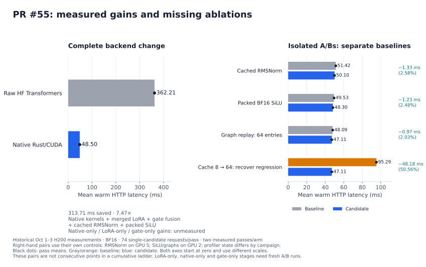
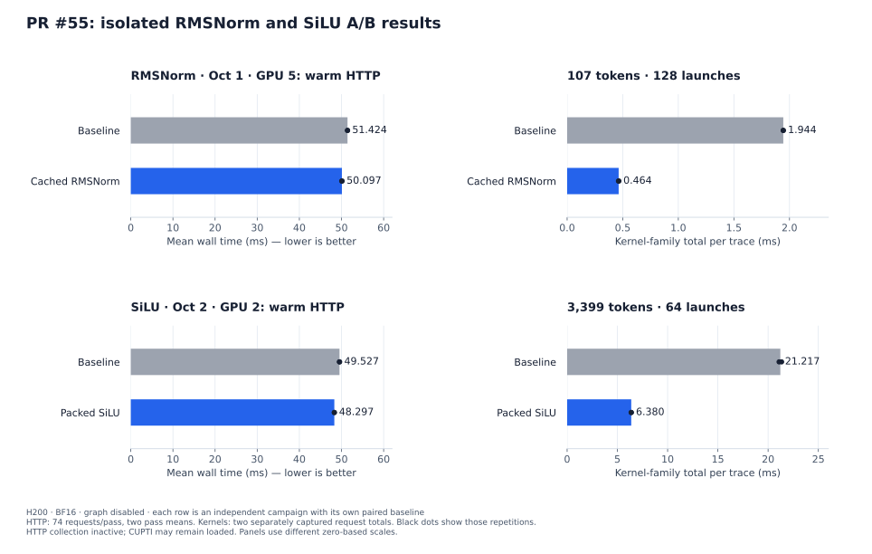
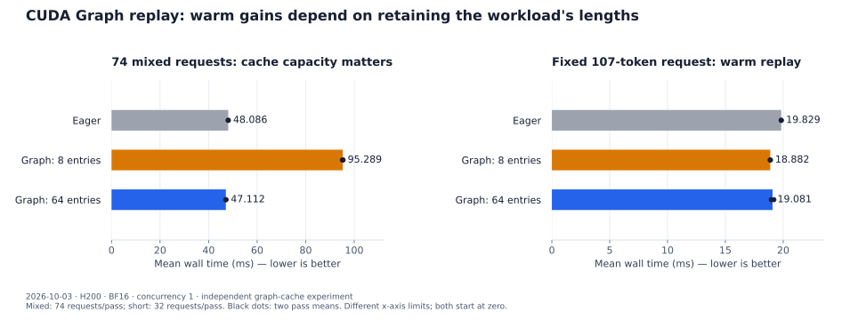
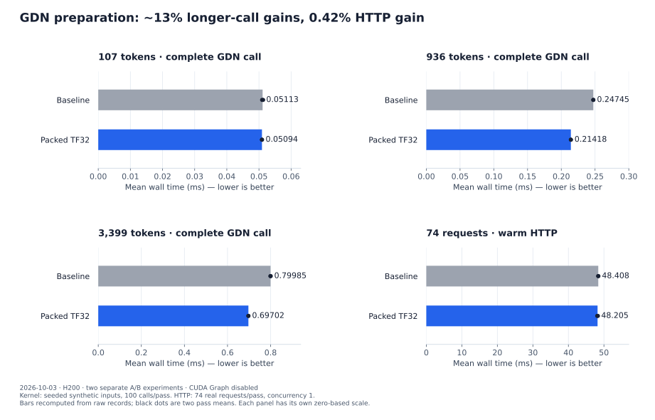
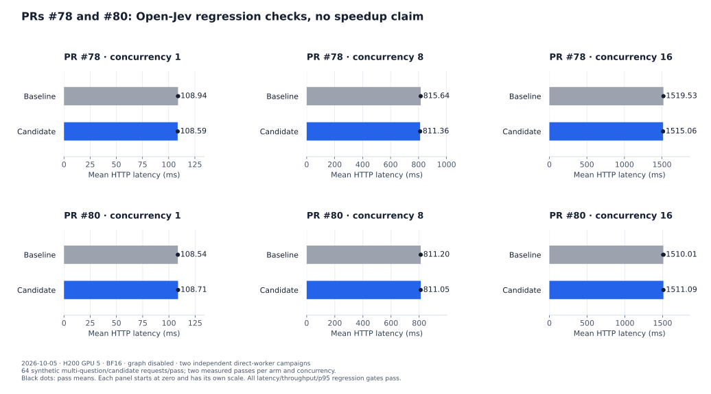

# Optimizing Open-Jev in System1-Omni

On our H200 workload, System1-Omni's native Rust/CUDA backend reduced Open-Jev
mean warm HTTP latency from **362.21 ms with raw HF Transformers to 48.50 ms**,
a **7.47× speedup**. Separate A/B experiments tested normalization, activation,
CUDA Graph caching and Gated DeltaNet preparation.

This post covers October 1–5, 2026. Each comparison has its own baseline;
the gains cannot be added together. **Merged GDN plus CUDA Graph performance
remains unmeasured.** Exact revisions, controls and repetitions are in the
[evidence ledger](../assets/blog/open-jev-20261005/source-data.json).

## PR #55: the matched backend comparison — October 3

The workload uses Open-Jev-27B-v1.1, BF16, 74 real JevBench `noul` requests,
one candidate per request, 80–3,399 tokens and concurrency 1 on one H200.
Each backend reused a server for an excluded feasibility pass and two measured
passes. The Rust frontend timer includes localhost HTTP, tokenization, worker
execution and response-body decoding; preparation, readiness, first inference
and warmups are excluded.

| Backend | Mean HTTP latency | Pass 1 / pass 2 |
| --- | ---: | ---: |
| Raw HF Transformers | 362.209 ms | 362.238 / 362.180 ms |
| Native Rust/CUDA, eager | 48.503 ms | 48.471 / 48.535 ms |
| OpenJev-Fast | 50.936 ms | 51.097 / 50.775 ms |



*Figure 1. The left panel measures the complete backend change; right-hand pairs
isolate individual changes in separate campaigns. They are not cumulative steps.
Dots show two pass means. [Full three-backend chart](../assets/blog/open-jev-20261005/backend-http.svg)
and [baseline setup](../../recipe/open_jev/validation.md#raw-hf-transformers-comparison-2026-10-03).*

Raw HF used unmerged PEFT LoRA, stock SDPA and PyTorch fallbacks for linear
attention/convolution, with optional FLA and causal-convolution dispatch disabled.
Native used merged weights and custom CUDA kernels; Fast used its own kernels
and graph stack. The comparison includes all these backend differences.

HF/native agreed on all 74 decisions and both scored 64/74, with maximum
probability difference 0.020423. Fast scored 63/74 with one different decision.
Native's mean was 4.78% below Fast, while Fast had a lower median. These subset
results do not establish general accuracy superiority. The
[upstream B300 results](https://yiqilyu.me/open-jev-fast/) use different hardware,
workloads and timing boundaries.

## How PR #55 reduces work

Rust validates and tokenizes candidates, runs a shared Qwen3.5/3.8 prefill
executor, downloads the final hidden state for the CPU scoring head, and
reconstructs the answer. Open-Jev has no autoregressive decode loop.

[PR #19](https://github.com/ThinkFlowLab/system1-omni/pull/19) supplied the Cua-S1
executor ancestry; [#52](https://github.com/ThinkFlowLab/system1-omni/pull/52)
tested graph replay on Cua-S1 separately. [#55](https://github.com/ThinkFlowLab/system1-omni/pull/55)
added Open-Jev support, including LoRA merging and attention-gate fusion.
The important distinction is between the **313.71 ms complete-backend saving**
and the smaller, individually tested tuning changes:

| Change | Work reduced | Isolated mean HTTP effect |
| --- | --- | --- |
| Native prefill path | Shared CUDA GDN/attention kernels and grouped projection GEMMs replace Python eager orchestration | Unmeasured individually |
| LoRA merging | Compute the adapter weight update once at export; remove inference-time low-rank projections | Unmeasured individually |
| Attention-gate fusion | Apply sigmoid/multiply in the attention epilogue; remove one launch and intermediate output write/read per full-attention layer | Unmeasured individually |
| Cached RMSNorm | Retain residuals in registers across reduction; avoid rereading them | **1.328 ms / 2.58% saved** |
| Packed SiLU | Use eight-element, 16-byte loads/stores | **1.230 ms / 2.48% saved** |
| Graph-64 replay | Replay warm exact-length forwards; reduce host kernel submission | **0.974 ms / 2.03% saved** |

The isolated tests quantify later tuning; they do not apportion the full
HF-to-native saving. Expanding graph-eight to 64 also fixes recapture thrashing:
its 48.18 ms recovery is against the regressed graph-eight baseline.

A cumulative chart needs a fresh, matched ladder: **raw HF → merged-LoRA HF →
native scalar/unfused baseline → fused gate → cached RMSNorm → packed SiLU →
Graph-64**. Keep prior changes enabled at each step, use one exact H200/workload/
HTTP timer, and collect one excluded feasibility plus two measured passes per
stage. The native-backend switch is still a grouped change. Intermediate
cumulative timings remain unmeasured; the records below support separate A/Bs.

Implementation references: [LoRA export](https://github.com/ThinkFlowLab/system1-omni/blob/61b83b380baca912c0dbd989d175cb3da8a881ae/recipe/open_jev/export_merged.py),
[gated attention](https://github.com/ThinkFlowLab/system1-omni/blob/61b83b380baca912c0dbd989d175cb3da8a881ae/src/backends/cuda/qwen3_5/attention.cu),
[model contract](../../src/models/open_jev/README.md), and
[Cua-S1 graph report](../benchmarks/cua-s1-cuda-graphs/README.md).

## PR #55: isolated kernel improvements — October 1–2

**October 1 — residual RMSNorm.** Cache rounded residual values in registers
instead of rereading them, and specialize widths 2560/5120. Thread assignment,
sum order and BF16 rounding remain fixed. The paired ABI4 libraries differed
only in normalization source (candidate SHA256 `756c9d40…`).

**October 2 — BF16 SiLU.** Process eight elements with aligned 16-byte loads and
stores, preserving `expf` and both BF16 rounding points. Cached RMSNorm stays
fixed; only SiLU changes (source SHA256 `b739f1bc…`). Other layouts use the scalar
fallback. Both changes landed in
[`61b83b3`](https://github.com/ThinkFlowLab/system1-omni/commit/61b83b380baca912c0dbd989d175cb3da8a881ae).

Both campaigns froze worker/frontend `202c0e1`, used BF16, graph disabled and
two measured 74-request passes after feasibility. RMSNorm used H200 GPU 5;
SiLU used GPU 2. HTTP profiling collection was inactive, though CUPTI could
remain loaded. Their timings belong to separate paired experiments.

| Change | Baseline passes (ms) | Candidate passes (ms) | Mean reduction |
| --- | ---: | ---: | ---: |
| RMSNorm | 51.440 / 51.409 | 50.144 / 50.049 | **2.58%** |
| SiLU | 49.563 / 49.490 | 48.286 / 48.307 | **2.48%** |



*Figure 2. Each row has its own paired baseline. HTTP dots are two pass means;
kernel dots are two captured request-family totals. Panels use different scales.*

All 74 native probabilities/decisions remained unchanged. Four RMSNorm and five
SiLU GPU tests passed. Both met the ≥2% HTTP gate with disjoint pass ranges and
their ≥25% kernel-family gates: short RMSNorm and long SiLU. Trace-family savings
measure selected kernels rather than the whole request. [Passes and hashes](../assets/blog/open-jev-20261005/ab-passes.jsonl).

## PR #55: graph replay and cache capacity — October 3

With `CUA_S1_GRAPH=1`, a new exact token length initializes GEMM plans, captures
the forward and replays it on later requests. Tokenization, transfers and CPU
scoring remain outside capture. Scratch growth clears cached graphs; capture
failure falls back to eager execution.

Eight cached lengths were enough for a repeated short request, but the mixed
workload's **57 lengths** caused eviction and recapture. The
[64-entry change](https://github.com/ThinkFlowLab/system1-omni/commit/3685d2037c6910a10ffa033db2262f734ba3fc11)
varied only capacity; eager used the eight-entry binary with graphs disabled.
Maximum scratch was warmed first, followed by feasibility and two measured passes.

| Workload | Eager mean | Eight-entry mean | 64-entry mean |
| --- | ---: | ---: | ---: |
| Fixed 107 tokens, 32 requests/pass | 19.829 ms | 18.882 ms | 19.081 ms |
| Mixed lengths, 74 requests/pass | 48.086 ms | 95.289 ms | 47.112 ms |



*Figure 3. Two pass means per configuration after warming maximum scratch.
The mixed eight-entry regression remains visible. [All runs and controls](../../recipe/open_jev/validation.md#native-cuda-graph-replay-2026-10-03).*

Graph-64 improved matched eager means by **2.03% mixed / 3.77% short**, passing
the declared 2%/3% gates with all 74 probabilities/decisions unchanged. New lengths still incur
capture cost, and more than 64 lengths can evict entries; graph mode stays opt-in.

Warm short traces showed one graph launch with the same 834 GPU kernels.
[NVIDIA notes overhead from individual graph-node tracing](https://docs.nvidia.com/nsight-systems/UserGuide/index.html#cuda-graph-trace),
so the latency comparison uses unprofiled HTTP runs. Traces verify submission;
unavailable hardware counters leave occupancy/stall diagnoses unresolved.

## PR #68: Gated DeltaNet preparation — October 3

[PR #68](https://github.com/ThinkFlowLab/system1-omni/pull/68) converts TF32 Q/K
once and packs meaningful bits into three-byte planes, matches baseline
four-term MMA accumulation, and stores U/W directly as BF16. Preparation's
shared memory drops from **92 to 72 KiB** while FP32 normalization/inversion and
rounding contracts remain fixed.

The baseline was `58b8cbe9`; candidate source SHA256 was `9f2642a5…`.
[The manifest](../../benchmarks/gdn/artifacts/20261003/manifest.json) freezes the
pair and separate kernel/HTTP protocols. Kernel runs timed the complete
preparation/state/output call on seeded synthetic inputs: ten warmups and two
100-call passes per shape/arm, with the second pass reversing arm order.



*Figure 4. Graph-disabled kernel and HTTP experiments. Dots show two pass means;
the HTTP arm uses 74 real requests/pass. [Raw records and numerical checks](../../benchmarks/gdn/README.md).*

The 936/3,399-token calls improved **about 13%**, passing the ≥10% gate in each
pass. HTTP means changed **48.408 → 48.205 ms (0.42%)**, missing the ≥2% gate;
baseline passes were 48.375/48.441 ms and candidate passes 48.105/48.305 ms.
All 74 native probabilities, decisions and token counts matched exactly.

BF16/FP16 variants failed numerical checks; eight-term TF32 changed intermediate
bits. Restoring four-term accumulation preserved sampled intermediates and
outputs bitwise. October 4 integration passed six GPU tests and 74-request
fidelity, without a new latency measurement. Modified-kernel execution was
validated on SM90. [Rejected variants and integration](../../benchmarks/gdn/README.md).

## PRs #78 and #80: processing/runtime regression checks — October 5

[#78](https://github.com/ThinkFlowLab/system1-omni/pull/78) separates
prepare, execute and finish ownership (`07e67e16` → `fbb974b5`).
[#80](https://github.com/ThinkFlowLab/system1-omni/pull/80) adds FIFO admission
before blocking dispatch, avoiding threads waiting at the model mutex and
preventing queued cancellations from dispatching (`cb3c37fa` → `887b29f1`).
Dispatched work retains its permit/resources until completion; GPU batching
remains planned. Both target cleaner execution boundaries with preserved behavior.

Each campaign used H200 GPU 5, BF16, eager CUDA and the same library/checkpoints
within its pair, collecting new baseline and candidate timings. Two 64-request
passes per model/arm/concurrency followed excluded feasibility and warmups.
Open-Jev's synthetic multi-question/candidate workload performs 224 forwards per
pass. Direct-worker timing includes client serialization and response validation,
so its ~109 ms serial mean is separate from the ~48 ms JevBench frontend result.

| PR / concurrency | Baseline passes (ms) | Candidate passes (ms) | Mean change |
| --- | ---: | ---: | ---: |
| #78 / 1 | 108.775 / 109.103 | 108.518 / 108.661 | −0.32% |
| #78 / 8 | 815.823 / 815.447 | 810.802 / 811.916 | −0.52% |
| #78 / 16 | 1,520.028 / 1,519.041 | 1,514.747 / 1,515.376 | −0.29% |
| #80 / 1 | 108.494 / 108.586 | 108.641 / 108.788 | +0.16% |
| #80 / 8 | 810.425 / 811.967 | 811.148 / 810.952 | −0.02% |
| #80 / 16 | 1,505.590 / 1,514.429 | 1,512.374 / 1,509.809 | +0.07% |



*Figure 5. Independent campaigns; dots show two pass means. Companion Cua-S1
results, throughput, p95 and observed variability are in the evidence ledger.*

Each campaign completed 1,536 measured requests across Open-Jev/Cua-S1 without
failures. Full responses matched except elapsed-time metadata. Every
model/concurrency passed the original regression gates: mean latency ≤105%,
throughput ≥95%, and mean per-run p95 ≤110% of baseline. These checks support
no material warm regression on the tested workloads; they establish no speedup.
Graph, Metal and full-frontend refactor comparisons remain unmeasured.

## Next measurements and evidence

Complete the PR #55 ladder above to attribute its bundled gain. Follow with
merged GDN with graphs disabled/enabled, including capture costs, and a separate
multi-candidate prefix-sharing comparison. [Ready-kernel trials](../../benchmarks/gdn/README.md#ready-kernels-in-vllm)
provide another candidate; full-model Rust integration remains unverified.

The [ledger](../assets/blog/open-jev-20261005/source-data.json) records exact
model/source revisions, device UUIDs, affinity, gates and pass values.
[The timing export](../assets/blog/open-jev-20261005/ab-passes.jsonl) preserves
**78 measured passes / 5,040 request timings** and response-file/semantic hashes.
Full response/protocol/source/trace archives remain local. HF/graph figures retain
published summary precision; GDN figures use committed raw records. H200 labels
correct archived `L20X` names for the SM90 devices. These historical measurements,
inspected against main `f594d7d`, are not a fresh benchmark of current main.

Regenerate figures with an existing Matplotlib environment, without GPU use:

```sh
python docs/assets/blog/open-jev-20261005/plot.py
mkdocs build --strict
```

Use the [native recipe](../../recipe/open_jev/native.md) for inference setup.
This edit adds no GPU measurements. Presentation references:
[Qwen3-Omni](https://vllm.ai/blog/2026-07-01-qwen3-omni-optimization) and
[Kimi K3](https://vllm.ai/blog/2026-09-13-kimi-k3-performance-optimization).
